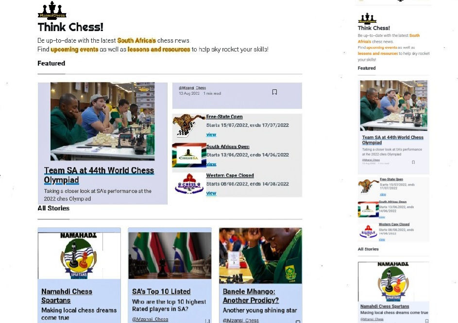

## Mzansi Chess
A south Africa's platform for chess enthusiasts. Meant for sharing local chess news and upcoming tournaments 

## Demo

#### link: https://mzansichess.pythonanywhere.com

### Features

- Chess News Blog
- Upcoming Tournament Updates
- Tournament Registration 
- Player Rankings, national & international

## Tech Stack

**✅** Python 

**✅** JavaScript
 
**✅** Django

**✅** Bootstrap 5 

**✅** Quill Rich-Text Editor 

**✅** HTML/CSS

## Feedback

If you have any feedback, please reach out to me on kmokhele48@gmail.com

## 🔗 Links

